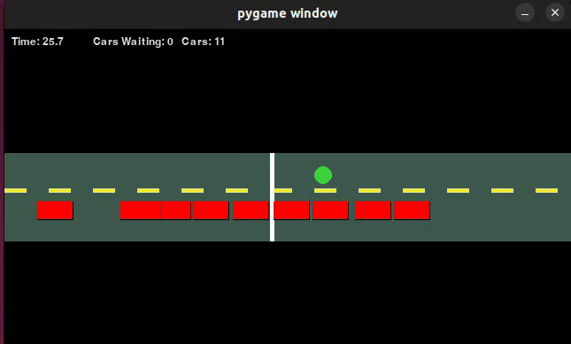

# Traffic Light Simulation (Pygame)

This program simulates cars approaching a **single-lane intersection** with a fixed-cycle traffic light.  
Cars are spawned at random intervals, approach the stop line, and either stop or proceed based on the light and queue in front of them.  

---
## Demo




##  How it Works

- **Traffic Light**
  - Alternates between red and green every `lightDuration` seconds.
  - Status is stored as a boolean (`False = Red`, `True = Green`).
  - Cars use a **FIFO queue** while waiting on red.

- **Cars**
  - Spawn at random intervals with an initial negative `x` position (off-screen).
  - Move at a fixed speed (`self.speed`).
  - If the light is **green**:
    - Cars move forward freely if no queue is present.
    - If queued, only the **front car** proceeds across the line.
  - If the light is **red**:
    - Cars stop at the line, or behind the car in front of them with a buffer (`DISTANCEBUFFER`).
    - Cars that have already crossed the line continue moving.
  - Each car records:
    - **Arrival time** (when spawned).
    - **Departure time** (when it passes the stop line).
    - **Wait time** = `departureTime - arrivalTime`.

- **Visualization**
  - Implemented in **Pygame**.
  - Black background with:
    - Grey road rectangle.
    - Yellow dashed center line.
    - White stop line.
    - Circle indicator for the light (`green` or `red`).
  - Cars are drawn as rectangles with colored fill.

---

## Simulation Metrics

At the end of the run:
- The program prints the **total number of cars processed**.
- Calculates the **average wait time** (seconds) across all cars.

Use trafficPlot.py to plot average wait time to number of simulations ran.

Example output:
15 cars waited an average of 7.31 seconds for the light to turn green

---

## Configuration

- **Window size**: `1280x720` (scaled down by half for the sim window).
- **Frame rate**: `FRAMERATE = 30`.
- **Stop line**: `STOPLINE = WIDTH//2 - 20`.
- **Car length**: `CARLEN = 40`.
- **Distance buffer**: `DISTANCEBUFFER = 5` (pixels between queued cars).
- **Light durations**:
  - `GREEN = 6` seconds.
  - `RED = 6` seconds.
- **Car speed**: `120 px/s`.

You can tweak these constants at the top of the file to change the traffic dynamics.

---

## Running the Simulation

Run the script directly:

```bash
python traffic_sim.py
